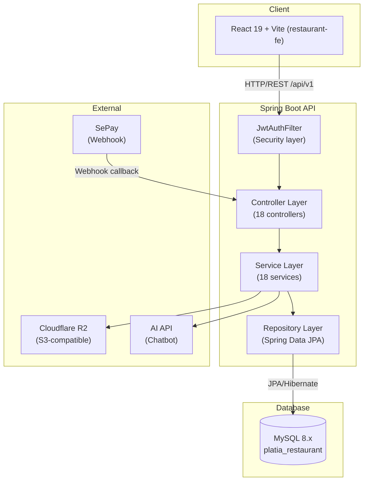
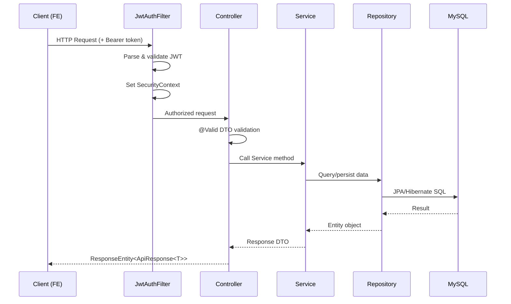

# Backend Architecture


## System Overview



**Architecture**: Monolith, Layer-based
- Mỗi layer là 1 package (folder)
- Tất cả controllers cùng một chỗ → dễ tìm
- Tất cả services cùng một chỗ → dễ navigate

---

## Folder Structure

```
src/main/java/com/web/web/
│
├── WebApplication.java           # Entry point (@SpringBootApplication)
│
├── Config/                       # Cross-cutting configuration
│   ├── SecurityConfig.java       # Spring Security, filter chain, BCrypt
│   ├── CorsConfig.java           # CORS cho Frontend (localhost:5173)
│   ├── JwtConfig.java            # JWT secret, expiration
│   └── S3Config.java             # Cloudflare R2 (S3-compatible)
│
├── Controller/                   # HTTP request handlers
│   ├── AuthController.java
│   ├── UserController.java
│   ├── ProductController.java
│   ├── CategoryController.java
│   ├── ProductTypeController.java
│   ├── CartController.java
│   ├── OrderController.java
│   ├── BookingController.java
│   ├── RestaurantTableController.java
│   ├── TableAreaController.java
│   ├── TableOrderController.java
│   ├── TableInvoiceController.java
│   ├── PromotionController.java
│   ├── NewsController.java
│   ├── ChatbotController.java
│   ├── UploadController.java
│   ├── SePayWebhookController.java
│   └── StatisticsController.java
│
├── Dto/                          # Data Transfer Objects
│   ├── (request DTOs)            # Input: CreateProductRequest, LoginRequest...
│   └── (response DTOs)          # Output: ProductResponse, OrderResponse...
│
├── Entity/                       # JPA Entities (17 entities)
│   ├── User.java, Role.java
│   ├── Product.java, Category.java, ProductType.java
│   ├── Cart.java, CartItem.java
│   ├── Order.java, OrderItem.java, Payment.java
│   ├── Booking.java
│   ├── RestaurantTable.java, TableArea.java
│   ├── TableOrder.java, TableInvoice.java
│   ├── Promotion.java
│   └── News.java
│
├── Exception/                    # Error handling
│   ├── GlobalExceptionHandler.java  # @RestControllerAdvice — tập trung xử lý
│   └── ResourceNotFoundException.java
│
├── Repository/                   # Data access (Spring Data JPA)
│   └── [Entity]Repository.java  # extends JpaRepository<Entity, Long>
│
├── Response/                     # Response wrapper
│   └── ApiResponse.java         # { success, data, message, error }
│
└── Security/                     # Spring Security internals
    ├── JwtAuthFilter.java        # Filter xác thực JWT mỗi request
    ├── JwtUtil.java              # Generate, validate, parse JWT
    └── UserDetailsServiceImpl.java
```

---

## Request Flow



### Layer Responsibilities

| Layer | Trách nhiệm |
|-------|-------------|
| `Config/` | SecurityFilterChain, CORS, Bean config |
| `Security/` | JWT parsing, UserDetailsService |
| `Controller/` | Routing, input validation, response format |
| `Service/` | Business logic, transactions, orchestration |
| `Repository/` | Data access, Spring Data JPA queries |
| `Entity/` | JPA entity mapping, relationships |
| `Dto/` | Input/output contracts |
| `Exception/` | Centralized error handling |

---

## Key Business Flows

### Checkout Flow

```
POST /api/v1/orders/checkout
    → JwtAuthFilter validates JWT → set user in SecurityContext
    → OrderController: @Valid CheckoutRequest
    → OrderService.checkout():
        1. Lấy Cart của user (CartRepository)
        2. Validate cart không trống
        3. Tạo Order (snapshot shippingAddress → JSON)
        4. Tạo OrderItems (snapshot productName, price từ Product)
        5. Tạo Payment record (status = PENDING)
        6. Xóa CartItems
        7. → @Transactional: nếu lỗi → rollback toàn bộ
    → Return OrderResponse
```

### SePay Payment Flow

```
POST /api/v1/webhook/sepay
    → SePayWebhookController: verify X-SePay-API-Key header
    → Tìm Payment bằng transaction ID / order ID từ payload
    → Cập nhật Payment.status = SUCCESS
    → Cập nhật Order.paymentStatus = PAID
    → (Optional) Trigger email gửi xác nhận
```

### Booking Flow

```
POST /api/v1/bookings
    → BookingController: @Valid CreateBookingRequest
    → BookingService:
        1. Kiểm tra bàn có trong khoảng thời gian yêu cầu không
        2. Kiểm tra capacity >= partySize
        3. Tạo Booking với status = PENDING
    → Return BookingResponse
```

---

## Security Configuration

```java
// SecurityConfig.java — filter chain
http.csrf().disable()
    .cors().and()
    .sessionManagement().sessionCreationPolicy(STATELESS)
    .authorizeHttpRequests(auth -> auth
        .requestMatchers("/api/v1/auth/**").permitAll()
        .requestMatchers(GET, "/api/v1/products/**").permitAll()
        .requestMatchers(GET, "/api/v1/categories/**").permitAll()
        .requestMatchers(GET, "/api/v1/news/**").permitAll()
        .requestMatchers(GET, "/api/v1/promotions/**").permitAll()
        .requestMatchers("/api/v1/webhook/**").permitAll()
        .anyRequest().authenticated()
    )
    .addFilterBefore(jwtAuthFilter, UsernamePasswordAuthenticationFilter.class);
```

---

## Configuration (Environment)

```bash
# application.properties hoặc .env
spring.datasource.url=jdbc:mysql://${DB_HOST}:${DB_PORT}/${DB_NAME}
spring.datasource.username=${DB_USERNAME}
spring.datasource.password=${DB_PASSWORD}

jwt.secret=${JWT_SECRET}
jwt.expiration=${JWT_EXPIRATION}

aws.accessKeyId=${AWS_ACCESS_KEY_ID}
aws.secretKey=${AWS_SECRET_ACCESS_KEY}
aws.region=${AWS_REGION}
aws.bucket=${AWS_S3_BUCKET}
aws.endpoint=${AWS_ENDPOINT_URL}

sepay.apiKey=${SEPAY_API_KEY}
```

---

## Service Layer Catalog

| Service | Chức năng chính |
|---------|----------------|
| `UserService` | CRUD user, đổi password, BCrypt |
| `ProductService` | CRUD sản phẩm, filter, upload ảnh |
| `CategoryService` | CRUD danh mục |
| `ProductTypeService` | CRUD loại sản phẩm |
| `CartService` | Quản lý giỏ hàng |
| `OrderService` | Checkout, lịch sử, admin quản lý |
| `BookingService` | Đặt bàn, kiểm tra availability |
| `RestaurantTableService` | CRUD bàn |
| `TableAreaService` | CRUD khu vực |
| `TableOrderService` | Order tại bàn |
| `TableInvoiceService` | Hóa đơn tại bàn |
| `PromotionService` (interface) + `PromotionServiceImpl` | Quản lý khuyến mãi |
| `PromotionScheduler` | Tự động bật/tắt promotion theo ngày |
| `NewsService` | CRUD tin tức |
| `ChatbotService` | Gọi external AI API (OKHttp) |
| `R2Service` | Upload ảnh lên Cloudflare R2 |
| `StatisticsService` | Báo cáo doanh thu, đơn hàng |